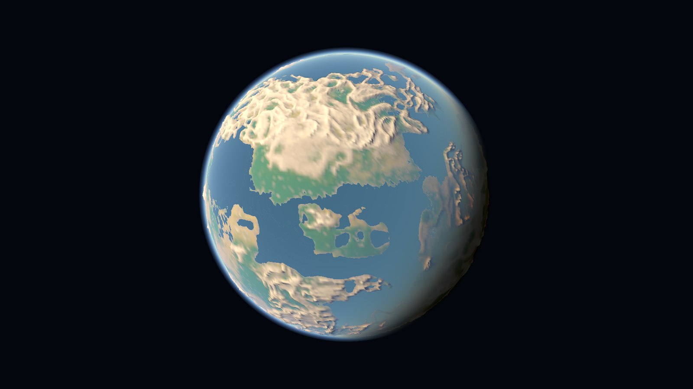
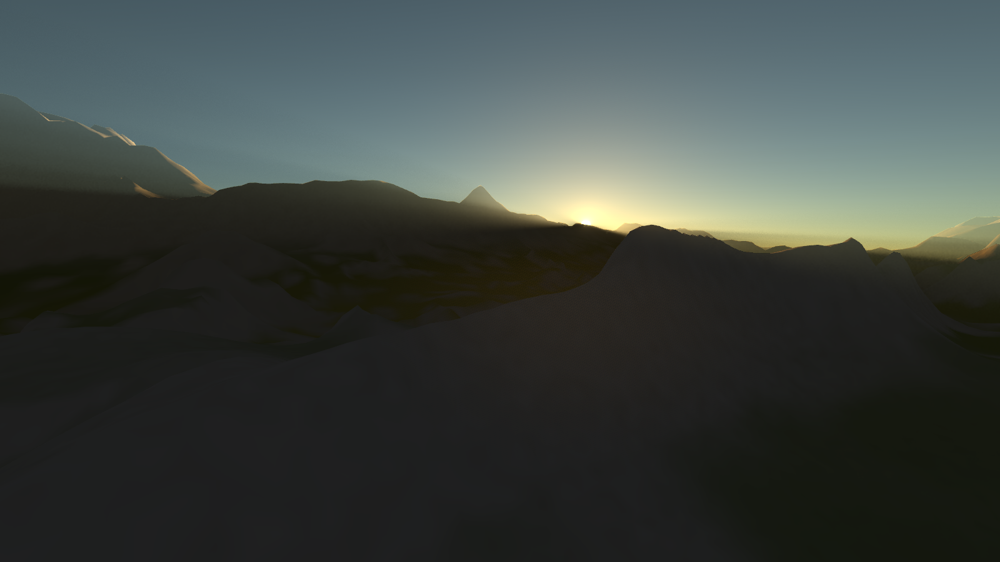
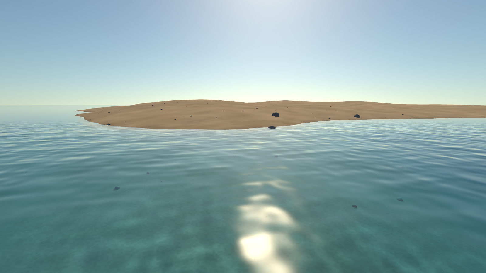
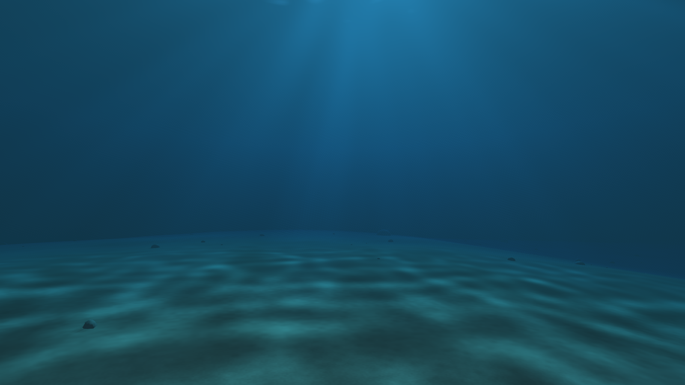

# Procedural Planet

A procedural planet showcase built with [GlyphEngine](https://github.com/derekmwright/glyphengine).
Fly from orbit through the atmosphere to mountains, sandy shores and underwater
terrain, then back into space. A seeded 500 km radius world uses adaptive terrain,
camera-relative rendering, terrain shadows, grass, rocks and wave-driven water lighting.



| Mountain shadows and atmospheric scattering | Shoreline water and surface reflections |
| --- | --- |
|  |  |



These are direct, HUD-free captures from the application. Reproduce them with
`python tools/capture_readme.py` after building. See
[water lighting and its limitations](docs/water-lighting.md) and
[rendering performance](docs/rendering-performance.md) for the current design.
Later sections of this README include historical implementation notes.

## Run

Requires Go 1.27+, CGo/GCC, and a Vulkan-capable GPU/driver. Windows is the
currently validated platform. The engine version is pinned in `go.mod`; no
sibling engine checkout is required. Compiled shaders are included.

```powershell
git clone https://github.com/derekmwright/procedural-planet.git
cd procedural-planet
go build -o bin/universebuild.exe .
.\bin\universebuild.exe
```

For development, `go run .` also works. The executable retains its original
`universebuild.exe` name so existing launch and profiling commands keep working.
Shader changes require `glslc` from the Vulkan SDK and `go generate ./atmosphere`.
Run `go test ./...` and `go vet ./...` to check the Go code.

The adaptive opaque depth prepass is enabled by default. Use
`-depth-prepass=off` for a baseline or `-depth-prepass=on` to force it during
profiling. `-pipeline-stats` adds optional GPU fragment/primitive counters to
the HUD and JSONL profile; leave it off for ordinary timing comparisons.

An experimental stream-power terrain modifier is available with `-erosion`.
To start above an eroded valley, run:

```powershell
.\bin\universebuild.exe -erosion-demo -longitude=40
```

Allow about ten seconds for startup erosion preparation. `-erosion-strength=0..2`
controls incision (default 1). This adds dry valleys and reshapes their side
slopes; flowing rivers and caves are not implemented. Erosion is off by default
while the landforms are evaluated. See [terrain erosion](docs/terrain-erosion.md)
for the method, measurements and remaining work.

To work against a sibling engine checkout, use an ignored local workspace rather
than changing the published dependency pin:

```powershell
go work init . ../GlyphEngine
```

Scroll forward to zoom toward the surface; scroll backward to pull away.
In orbit mode, the view gradually tilts toward the horizon as you approach.
**W/S** translate along your view direction and **A/D** yaw left/right. Using
these keys automatically takes over from orbit mode without changing the view;
there is no need to press Tab before moving. **Shift** boosts movement speed.

| Control | Orbit / descent | Free flight |
|---|---|---|
| Mouse drag | Orbit the planet | Look around |
| Arrow keys | Orbit the planet | Look around |
| W / S | Enter flight; move forward / backward | Move forward / backward |
| A / D | Enter flight; yaw left / right | Yaw left / right |
| Q / E | Enter flight; move down / up | Move down / up relative to the planet |
| Mouse wheel | Zoom toward / away from surface | Zoom toward / away from surface |
| Shift | Movement speed boost | Movement speed boost |
| Space | Toggle automatic orbit | — |
| Tab | Switch to flight | Switch to orbit / descent |
| Home | Reset to starting orbit | Reset to starting orbit |
| F | Toggle atmosphere | Toggle atmosphere |
| R | Toggle sun rays | Toggle sun rays |
| H | Toggle local cast shadows | Toggle local cast shadows |
| M | Toggle surface material detail | Toggle surface material detail |
| O | Toggle sea-level water | Toggle sea-level water |
| G | Toggle nearby grass blades | Toggle nearby grass blades |
| P | Toggle performance HUD | Toggle performance HUD |
| F8 | Log performance marker | Log performance marker |
| Escape | Quit | Quit |

Flight speed scales with ground clearance; near the surface it slows to walking
speeds. The camera has a two-meter floor above both the procedural surface and
the currently rendered terrain. This is a flight/hover camera, not a character
controller with gravity, slopes, or jumping.

```powershell
# Another world
go run . -seed 42 -radius-km 750

# Start near the ground; allow a few seconds for refinement
go run . -altitude 100 -flight

# Hands-off 58-second descent, surface hold, and return to orbit
go run . -tour
```

## Terrain and rendering

The same deterministic 3D noise field supplies every detail level: broad
basins/highlands, mountain ridges, local hills, and rock-scale relief. Feature
wavelengths and amplitudes are in meters, independent of planet radius. The
planet uses vertex colors with no external assets.

Localized mountain belts now add nested ridges at 26, 11, 4.2, and 1.5 km
wavelengths. Warped range masks preserve the existing lowlands. A 4,000-point
sample of seed 7 finds a maximum additional mountain height of 8,160 m, with
1,929 samples outside the mountain belts. This is procedural ridge noise, not
an erosion simulation. Cast shadows currently cover nearby terrain only.

Near the surface, seeded cube-face cells scatter small stones and occasional
boulders using three irregular mesh variants and three GPU instance sets.
Placement persists across travel and cube seams. Rocks follow the current
terrain surface, use camera-relative coordinates, and shrink out between 180
and 230 m from the camera. Their scales range from 0.12 to 2.8, with the largest
meshes roughly five meters across. They currently have no collision; nearby rocks now cast shadows. The ground check showed 613 visible-range instances; the HUD reports
the current instance count, including instances outside the camera frustum.

```powershell
# Stones and boulders on the default lowland terrain
go run . -altitude 2 -flight

# A rugged mountain basin in daylight
go run . -longitude -76.5681 -latitude -12.3 -altitude 900 -flight
```

Rock placement determinism, cube-seam coverage, mesh winding, and mountain
relief/lowland retention are tested. Ground, mountain, and full 3,600-frame
descent/ascent captures passed Vulkan validation. The tour returned to 96
terrain patches after 94 splits and 94 merges. Captures are
`captures/rocks-ground.png`, `captures/mountain-range.png`, and
`captures/rocks-tour.png`.

- Six cube faces start with 96 patches. Nearby patches split into four;
  distant patches merge. Split and merge thresholds differ to reduce chatter.
- Adjacent patches differ by at most one level, including across cube faces.
  Refinement demand propagates through neighbours so required patches cannot
  immediately merge again while waiting for the next split.
- Inward, double-sided edge skirts conceal LOD gaps. These are not watertight
  stitched edges; edge morphing and smooth visual transitions remain future work.
- One worker builds a group of four children at a time. The main thread uploads
  at most two child meshes per frame. The parent remains visible until the
  complete child group is ready, then they replace it together.
- GPU meshes use GlyphEngine's dynamic per-frame buffers and are pooled for
  reuse. Parents remain cached for immediate coarsening. Active terrain is
  capped at 960 patches; the pool retains its peak allocation for later travel.
- Coordinates and generation use float64. Mesh vertices are patch-local;
  the camera is subtracted from patch origins before conversion to float32.
  Near-ground patches are small enough to preserve local precision.
- The default planet refines to level 16, with at most roughly 0.48-meter
  vertex spacing at the finest level. The maximum level scales with radius.

The overlay reports active geometry (including skirts), maximum active LOD,
ground clearance, terrain update time, the last four-child generation time,
and GPU mesh count. A GPU mesh owns multiple Vulkan buffers; this is not an
individual buffer count. `dt` is the smoothed simulation frame interval: with
`-frames` it is fixed, **not a frame-rate benchmark**. Generation time is worker
time normally, but part of the main-thread time in `-sync-terrain` mode.

Lighting uses a fixed directional sun and a spherical atmosphere. Nearby rock
and terrain shadows are supported. Distant mountain shadows, material textures,
and a walking controller remain unimplemented.
Terrain can visibly pop while detail levels change;
rapid movement or spawning near the ground can outrun refinement temporarily.

## Atmosphere

The orbital rim, surface sky, terrain haze, and sunset light use the same
spherical single-scattering approximation. Air density falls with height, blue
light scatters more strongly, aerosols add haze near the sun, and the solid
planet blocks sunlight on the night side. Terrain integrates atmosphere only
as far as the visible fragment; it does not receive a transparent shell drawn
over foreground geometry. This follows the sky/surface integration approach in
[Sean O'Neil's GPU Gems 2 chapter](https://developer.nvidia.com/gpugems/gpugems2/part-ii-shading-lighting-and-shadows/chapter-16-accurate-atmospheric-scattering).

Press **F** to compare at the same viewpoint, or launch with `-atmosphere=false`.

The engine's screen-space sun shafts are enabled by default. **R** toggles them;
`-sun-rays=false` disables them at startup. The same shafts remain active in space, with visibility following the spherical
horizon. They are zero when the atmosphere is disabled.
The narrower 0.55-screen-height radius and HDR luminance threshold of 1–2 keep
the effect concentrated near the sun. These are artistic settings, not physical
scattering coefficients. The pass samples scene brightness without depth, so
it approximates rays around ridgelines rather than tracing terrain shadows
through the atmosphere. No engine changes are required.

To reproduce a sun-facing view, use `-flight -heading -63.2 -longitude 51.8427734
-latitude 0 -altitude 1000`. Heading is degrees east of local north. Changing
longitude to 54 and altitude to 100 places the sun behind a nearby ridge.
Paired 360-frame synchronous on/off captures and the ridge view passed Vulkan
validation; captures are `captures/sun-rays-{on,off,ridge}.png`.

The default 500 km planet uses a 3.5 km molecular scale height and a 21 km
atmosphere cutoff. Parameters scale within bounds for the configurable radius;
they are tuned for this smaller world rather than a scientific Earth model.
The shader uses 16 view samples and six samples for each sunlight path. It has
no clouds, multiple scattering, refraction, or mountain-shadowed scattering. Low sample
counts and changing terrain LOD can still show artifacts at grazing angles.

The paired shader overrides and their source live in `atmosphere/`; the SPIR-V
is embedded, so normal builds need no shader compiler. After changing GLSL:

```powershell
go generate ./atmosphere
go build -o bin/universebuild.exe .
```

Shader generation needs `glslc` from the Vulkan SDK on PATH. The application
currently owns the six sky-palette UBO slots as custom atmosphere parameters.
Both shaders decode that same layout. Do not mix them with the stock sky, fog,
or cloud shaders; proper application-owned uniform bindings are tracked in
[GlyphEngine #94](https://github.com/derekmwright/glyphengine/issues/94).

Validation captures include orbit, a 100 m daytime view, the terminator, the
night side, and a full descent/ascent. An initial 600-frame timing sample at
100 m on the RX 7900 XTX / 1440x900 / MSAA 4x measured GPU frame means of
1.578 ms with atmosphere and 0.342 ms without. These are preliminary per-run
means including terrain refinement, not a repeat-run performance guarantee.
Use `GLYPHENGINE_TIMING=1` to collect actual GPU timestamps; the fixed `dt` HUD
value in capture runs is not a benchmark.

## Verification

```powershell
go test ./...
go test -race ./...
go vet -unsafeptr=false ./...

New-Item -ItemType Directory -Force captures
# Repeatable full descent/ascent, using the same upload/swap path
go run . -tour -sync-terrain -frames 3600 -vsync=false -validate -screenshot captures/returned-orbit.png
# Ground view on the intersection of three cube faces
go run . -longitude 45 -latitude 35.26438968 -altitude 2 -sync-terrain -frames 800 -vsync=false -validate -screenshot captures/cube-corner.png
```

`-frames` fixes the simulation clock to 1/60 second; `-sync-terrain` removes
worker-timing variability for geometry comparisons. Interactive mode uses the
background worker. `-longitude`, `-latitude`, and `-altitude` reproduce a location.

Tests cover seed repeatability, face/patch seams, normals and winding, complete
LOD coverage, 2:1 balance after transitions, convergence and coarsening, radial
collision against actual mesh triangles, skirt index bounds, worker shutdown,
camera clearance, and flight orientation across a pole.

Measured on 2026-09-21 with the default seed/radius on an RX 7900 XTX:

- Default ground view: 378 active patches, level 16, 967,680 triangles including
  skirts, 472 allocated GPU meshes, two-meter clearance.
- Full 3,600-frame descent/ascent: 94 splits and 94 merges, returning to 96
  active patches at level 2. Both synchronous and worker runs completed with
  no Vulkan validation messages.
- Cube-corner ground view: 222 patches at level 16, with no Vulkan validation
  messages. Captures are in `captures/` (ignored by Git).

These checks validate the transition and resource path; still images do not
establish that motion is free of popping, shimmer, or every possible seam artifact.

### Terminator lighting investigation

GlyphEngine's `shaders/lit.frag` tilts normals toward global +Y for roughness
above 0.9, a grass-specific lighting heuristic. Planet rock previously used
0.98, incorrectly triggering it. The showcase switched to 0.9 to bypass that
heuristic; the later custom atmosphere shader honors supplied normals directly.
The engine itself is unchanged. Long-term, grass normal treatment
should be independent of material roughness.

Coarse patches also now sample normal derivatives over half a grid cell
(minimum 0.5 m), rather than using sub-meter detail at every resolution.
`TestCoarseNormalsFollowResolvedGeometry` measures summed `1 - dot(normal,
triangle normal)` on seed 7, face 0, level 8, cell (27,128): 14.671947 before,
6.324341 after, a 57% reduction. This measures alignment to resolved geometry,
not a claim that every visible terminator artifact is fixed. Normals at differing
LOD boundaries can still differ. Cast shadows now cover nearby terrain only.

Reproduction: `-longitude 51.8427734 -latitude 0 -altitude 1000 -frames 500
-sync-terrain -vsync=false`. Before, material-only, and filtered-normal captures
are saved as `captures/terminator-before.png`, `terminator-after.png`, and
`terminator-filtered.png`. The final render passed Vulkan validation.

## GlyphEngine findings

Confirmed findings from the showcase are tracked upstream. Planet generation,
LOD, and atmospheric art direction remain consumer responsibilities.

| Issue | Finding |
|---|---|
| [#93](https://github.com/derekmwright/glyphengine/issues/93) | Generic rough materials acquire a grass-specific global-up normal bias |
| [#94](https://github.com/derekmwright/glyphengine/issues/94) | Custom shaders need application-owned per-frame uniform bindings |
| [#95](https://github.com/derekmwright/glyphengine/issues/95) | Device-local mesh uploads wait for the graphics queue per buffer |
| [#96](https://github.com/derekmwright/glyphengine/issues/96) | Distinct geometry cannot share public mesh draw ranges; measure batching before adding indirect draws |

Issue bodies with source references, reproduction details, current workarounds,
and acceptance checks are retained in `docs/engine-issues/`. Shader parameters
and material correctness are immediate needs; indirect batching is a measured
follow-up, not an established bottleneck. The 100 m view had 294 active patches
but 80 total draws after culling, including non-terrain passes.

### Local shadows and mountain occlusion

Rock and terrain cast shadows are enabled by default; **H** or `-shadows=false`
provides an on/off comparison. The near cascade preserves local detail and fades
into the mountain cascade by receiver distance. Both retain distant caster reach,
while atmospheric scattering samples mountain visibility. Shadows turn off at
12 km ground clearance.

Underwater, cast shadows fade out over the first two metres of camera depth, then
caster draws and shadow lookups stop. Surfacing restores them automatically.
Use `-underwater-shadows` to retain the previous underwater shadows. This is a
visual/performance approximation: it suppresses terrain occlusion rather than
tracing refracted, scattered shadow light. Caustics and underwater shafts remain
active. The HUD reports effective shadow strength alongside the H setting.

See [terrain shadow filtering](docs/terrain-shadows.md),
[water lighting](docs/water-lighting.md) and
[rendering performance](docs/rendering-performance.md) for validation and limits.


### Foreground surface materials

Procedural surface shading adds soil grain, coarser scree on intermediate
slopes, and cooler exposed rock on steep faces. It adjusts color and the shading
normal on both terrain and scattered rocks without adding triangles or changing
collision. Scree distribution is slope-based, not a simulation of loose-rock
accumulation. **M** toggles the pass; `-materials=false` starts without it.

The continuous 3D field needs no UV seams or texture assets. Detail wavelengths
are 8 m, 2 m, 25 cm, and 6.25 cm. Pixel-footprint filtering suppresses unresolved
frequencies; overall detail fades between 160 and 700 m. Camera coordinates are
reduced modulo 4096 m in double precision before upload, keeping the material
anchored while preserving close-up precision. The field therefore repeats every
4096 m along each world axis. Custom parameter slots 5.yz and 4.z carry the eye
remainder, and slot 4.y controls material detail.

Paired ground captures (`captures/materials-on.png`, `materials-off.png`) and
`captures/materials-mountain.png` were inspected. Coordinate tests check less
than 1 mm drift across camera wrapping boundaries. Tests, vet, and the full
3,600-frame descent/ascent Vulkan validation passed. These checks do not prove
all movement is free of shimmer; use M at the same viewpoint for comparison.

### Spherical sea-level water

Water is enabled by default at +250 m above the planet reference radius.
`-sea-level` accepts -2500 to 10000 m; **O** or `-ocean=false` toggles water.
The HUD reports both terrain clearance and signed height above sea level.
Flight still follows the terrain collision floor, so descending over an ocean
allows underwater exploration rather than stopping at the water surface.

```powershell
# A shoreline at the foot of the mountains, seed 7
.\bin\universebuild.exe -longitude -62 -latitude 22 -altitude 2

# Raise the global sea level
.\bin\universebuild.exe -sea-level 600
```

The paired sky and terrain shaders intersect each view ray with an analytic
sea-level sphere and composite water only in front of opaque geometry. This
adds no water meshes or draw calls. It also means the ocean follows the
currently rendered terrain silhouette; coastal details can change as terrain
LOD refines. Below-sea-level enclosed basins fill too. These are not independently
elevated lakes, and there is no drainage or river simulation yet.

Appearance includes wavelength-dependent absorption, a clear shallows band,
Fresnel sky reflection, solar glints, and animated shading ripples that fade
with distance and pixel footprint. The reflection evaluates our atmosphere;
it does not reflect terrain or rocks. There is no refraction, foam, wave geometry,
buoyancy, or underwater total internal reflection. Underwater views attenuate
both sunlight and visibility with depth; the surface window is approximate.
WATER_CLARITY in atmosphere/ocean.glsl is now 2.0: light and visibility
carry twice as far as the original water. This is a shader constant.

The stock engine water targets a flat heightmap. The showcase uses its existing
shader override capability for the spherical surface; no engine changes or new
engine issue were needed. Parameter slot 4.x holds water radius in km (zero is
disabled), and slot 3.z holds periodic wave time. Atmosphere cutoff remains six
Rayleigh scale heights; sun energy remains 6.

Orbit, shoreline, underwater, disabled-water, and descent/ascent validation
runs were checked. Captures: `captures/ocean-orbit.png`, `ocean-coast.png`,
`ocean-underwater.png`, and `ocean-tour.png`. The full tour returned to 96 terrain
patches after 94 splits and 94 merges. Tests and vet passed.

### Ocean performance pass

The ocean now skips the seabed atmosphere march wherever water fully replaces
it, and skips bed materials/lighting/shadows after 800 m of optical water travel
(blue transmission is then below 1e-6). Sky pixels covered by deep water likewise
skip their discarded background atmosphere. The reflected sky retains the full
original scattering calculation.

Measured on RX 7900 XTX, 1440x900, 4x MSAA, fixed 600-frame runs, synchronous
terrain, VSync disabled, at `-longitude -62 -latitude 22 -altitude 2`:

| GPU frame time | Run 1 | Run 2 | Run 3 | Mean |
|---|---:|---:|---:|---:|
| Before | 5.689 ms | 5.694 ms | 5.682 ms | 5.688 ms |
| After | 4.577 ms | 4.564 ms | 4.620 ms | 4.587 ms |

This is a 19.4% reduction in GPU frame time for this shoreline view. Matched
600-frame captures were pixel-identical below the HUD (rows 210 onward).
This is not a claim about all viewpoints, resolutions, steady-state frame rate,
or measured power/fan speed. Timing logs and captures are in
`captures/water-perf-before-*` and `captures/water-perf-after-*`.

### Vegetation from orbit to the ground

Seeded moisture regions blend green lowlands, olive uplands, and golden dry
areas into the existing soil/rock colors. Both terrain vertex color and grass
placement call the same `Planet.GroundCover` rules. Coverage fades in between
8 and 65 m above sea level, fades out near the configured elevation ceiling,
and excludes steep slopes. Beaches and underwater terrain remain bare.
Coarse terrain uses its filtered surface normal for slope selection; region
boundaries gain detail as the terrain refines.

Nearby grass is a nine-blade mesh, instanced with seeded colors, scale, and
yaw. A small CPU-driven lean adds a breeze. Ground material detail remains
visible after blades shrink out between 35 and 50 m. Interactive scatter work
runs on a background worker; synchronous validation uses deterministic generation.
The GPU instance capacity is 20,000, with distance and behind-camera filtering
before upload. Blades receive local lighting/shadows but do not cast shadows,
have collision, or flatten under the camera. Density is bounded by the upload
capacity. Grass materials and placement are showcase code; instancing, buffers,
render pipelines, culling, and draw submission come from GlyphEngine.

```powershell
# Green meadow with distant mountains
.\bin\universebuild.exe -longitude -45 -latitude -13 -altitude 2

# Tunable vegetation band and blade density
.\bin\universebuild.exe -grass-height-max 2200 -grass-slope-max 32 -grass-density 0.7
```

**G** or `-grass=false` disables blades while retaining ground vegetation.
`-vegetation=false` disables both terrain vegetation colors and scatter.
Defaults: elevation ceiling 2600 m above sea level, slope ceiling 38 degrees,
density multiplier 1. Allowed ranges: height 100–10000 m, slope 5–60 degrees,
density 0.1–2.

Mask tests exclude underwater ground, alpine terrain, and cliffs. Scatter tests
check deterministic placement and shared-mask eligibility. Tests, race tests,
vet, worker-mode rendering, and a full descent/ascent Vulkan validation run
passed. Captures include `vegetation-orbit.png`, `grass-ground.png`, and
`grass-worker.png` in `captures/`.

A preliminary 600-frame meadow comparison at 1440x900, 4x MSAA on RX 7900 XTX
measured 4.444 ms GPU with 2,506 tufts vs 4.147 ms without blades (one run each,
fixed simulation clock). This preceded the final narrower-blade and color tweak;
it is an initial cost indication, not a repeated benchmark or a frame-rate guarantee.

### Live performance instrumentation

The performance HUD is enabled by default (`-perf=false` starts hidden).
**P** toggles it; **F8** logs a marker to the console and to the profile file
when one is open. Keep VSync enabled for normal exploration: GPU timestamps
measure actual GPU work independently of presentation pacing.

```powershell
.\bin\universebuild.exe -profile captures/flight-profile.jsonl
```

The optional JSONL file appends one sample per wall-clock second plus F8
markers. It records UTC, frame number, actual framebuffer resolution, VSync,
fixed-simulation status, camera position/direction, seed, planet/sea settings,
feature toggles, underwater state, draw/instance/triangle counts, GPU passes,
and CPU measurements. `-width` and `-height` set the initial window size;
recorded resolution is the actual framebuffer size after any resizing.

Frame/GPU/update statistics use the last 120 sampled frames and refresh at
most four times per second. P95 is the 95th-percentile frame cost. Wall FPS
comes from measured wall time, not the fixed simulation delta shown separately.
GPU queries lag by a few frames and unavailable timestamps are explicitly
shown as unavailable. CPU engine phase means are labeled *session averages*;
the per-update terrain/rock/grass timings are rolling main-thread measurements.
They do not measure background worker CPU time. Startup, synchronous generation,
and LOD rebuild spikes remain visible in the window rather than being hidden.

Our custom water and atmosphere shaders are charged to **opaque** and **sky**.
The engine's separate water/grass passes do not account for our analytic ocean
or ordinary instanced grass. A large GPU wait can mean pacing or GPU load;
compare it with GPU milliseconds. These metrics do not measure temperature,
power, utilization percentages, or fan speed.

Initial underwater ablations at default location, 2 m terrain clearance
(about 123 m below sea level), RX 7900 XTX, 1440x900, 4x MSAA, 600 fixed frames,
synchronous terrain, VSync off: 3.132 ms mean GPU normally; 0.928 ms with
atmosphere disabled; 2.628 ms with ocean disabled. One run each: this identifies
atmospheric work as the larger component at this pose, not a general performance
guarantee or a diagnosis of fan behavior at another resolution/viewpoint.
Logs are `captures/perf-underwater*.log`, `perf-no-ocean.log`; JSONL samples and
`perf-hud.png` demonstrate the instrumentation. Tests, vet, and validation passed.


### Underwater shader optimization

Submerged rays now use water absorption instead of marching the atmosphere
through water. Surface windows evaluate air beyond the water exit; obscured
geometry skips material and lighting work. Visible seabed retains its detail.
The visibility cutoff scales with clarity (originally 400 m, now 800 m).

RX 7900 XTX, 3840x2054, 4x MSAA, 450 fixed frames, synchronous terrain,
VSync off, default location, -sea-level 142.5 -altitude 2 (15.1 m deep):

| GPU frame time | Run 1 | Run 2 | Run 3 | Mean |
|---|---:|---:|---:|---:|
| Before | 13.008 ms | 12.733 ms | 12.727 ms | 12.823 ms |
| Optimized, original clarity | 3.170 ms | 3.207 ms | 3.198 ms | 3.192 ms |

This is a 75.1% reduction at this pose. Matched captures differed by at most
one 8-bit RGB step outside the HUD before clarity tuning. The subsequent
clarity increase intentionally changes appearance; its final validation run
measured 3.272 ms GPU time. These measurements do not measure fan or power use.
Logs/captures: captures/underwater-opt-* and captures/underwater-clear*.
Shoreline, disabled-ocean, and full descent/ascent Vulkan validation passed;
Go tests and vet passed. This was showcase shader work, requiring no engine fix.
Historical shoreline timings above used the original clarity and 400 m cutoff.


### Underwater sunlight detail

Animated procedural caustics now modulate direct lighting on submerged terrain
and rocks. They follow world coordinates, respect local shadows, and fade with
depth, low sun angle, and pixel footprint. Camera-relative depth avoids stepped
pattern edges from subtracting planet-sized floats.

Subtle underwater shafts use four bounded samples of a broad animated light
field. R / -sun-rays=false toggles these as well as the existing above-water
shafts. The integration ends at visible geometry or the surface. These are
artistic approximations, without wave refraction or terrain-shadowed volume
lighting; no bubbles or suspended-particle geometry have been added.

A 3840x2054 shallow-water check measured about 3.6 ms GPU versus 3.3 ms before
these details; this is a single-run estimate, not a general benchmark. Captures:
captures/underwater-caustics.png and captures/caustics-coast.png. Go tests and
vet passed, plus Vulkan validation of the descent/ascent tour, coast, and
ray/shadow toggles. Slot 5.x now packs local shadows (1) and water shafts (2).


### Looking up through water

The underwater surface now bends the sky view through animated ripple normals,
with transmitted sun glints and caustic highlights concentrated around the
refracted sun. Their intensity spreads and fades away from that source. Beyond
the sky window, a softened transition shows an approximate dark underside
(no reflected terrain). Shafts now use eight bounded samples, follow refracted
sunlight, and have stronger directional contrast. R still toggles the shafts.

Reproduce the upward view with -sea-level 142.5 -altitude 2 -flight
-heading -72 -pitch 55. The new -pitch option accepts -85 to 85 degrees above
the horizon and only sets the starting flight view. Capture: captures/water-look-up.png.
A 3840x2054, 450-frame run measured 2.072 ms mean GPU for this upward pose
(not comparable to seabed-facing timings). Shader compilation, Go tests, vet,
and upward-view/descent-ascent Vulkan validation passed.


### Underwater shaft banding correction

Replaced eight discrete volume samples with the analytic integral of a smooth
periodic light field and exponential absorption. This removes sample-plane
banding. The field is constant along refracted sunlight: each point projects
back to its water-entry coordinate. Seabed caustics now use that refracted
direction too. Shafts remain an artistic approximation without terrain shadows.
Checked 100 integrals against dense numerical quadrature (maximum absolute
error below 0.000003), Go tests/vet, and Vulkan validation of shallow-angle,
upward, and descent/ascent views. Captures: water-beam-angle.png and water-beam-up.png.


### Current shaft appearance

The analytic volume field above was superseded: it still read as nearly uniform
haze in shallow forward views. Current shafts are an angular approximation
centered on the refracted sun, with irregular animated beam widths, dark gaps,
and depth/view-travel attenuation. This deliberately favors visible descending
beams over physical volume integration; it is not terrain-shadowed volumetric
lighting. R toggles it. Surface glints and seabed caustics remain separate.
Visual check at 7.8 m depth: captures/water-shaft-contrast.png. Reproduce with
-sea-level 137.3 -altitude 2 -flight -heading -72 -pitch 20.


### Localized caustic highlights

Fine seabed caustics are now gated by broad moving illumination patches in
the same refracted light-entry coordinates. Filtering fades the effect from
80 to 300 m viewing distance and at subpixel scales. From above, an artistic
reflected-sun weighting prevents enhancement around every shallow coastline.
The underwater surface highlight is more tightly concentrated around the sun.
These masks approximate the appearance; individual wave-focused light paths
are not simulated. Captures: caustics-localized-above.png and
caustics-localized-below.png. Tests, vet, and Vulkan validation passed.


Underwater scattering now uses half-resolution engine render passes by default.
Use `-water-passes=false` for the original full-resolution A/B baseline. The GPU
HUD reports water scattering/composite costs. See `docs/water-lighting.md` for
measurements, validation, and remaining above-water costs.

Water now defaults to a GPU-cached broad wave spectrum. Use `-wave-cache=false`
for the previous five-wave field. Building requires Go 1.27, matching GlyphEngine.

Caustics now default to a forward-projected light atlas that accumulates
overlapping refracted rays, with a filtered shorter-wave band. Use
`-caustic-cache=false` for the old inverse solver. The GPU HUD reports focusing
separately; see [water-lighting.md](docs/water-lighting.md) for reproducible
comparisons, local coverage limits, and remaining overhead-sun limitations.
The projection now integrates four spatial samples per cache texel and applies
depth-dependent diffusion. Grid-aligned cache movement reduces highlight jumps
without changing wave speed or adding screen-space history trails.
Caustic brightness also uses a short, world-aligned temporal filter to reduce
flicker as narrow light folds move between samples. `-caustic-temporal=false`
compares spatial filtering alone. Both paths keep the same wave motion.

Shoreline foam and animated wet sand are enabled by default. Use
`-shore-foam=false` for an A/B comparison. Foam is a shallow-water surface effect;
wave geometry does not break or run up the beach yet.

Terrain streams through asynchronous GPU-local uploads by default. Use
`-async-terrain-uploads=false` to compare the previous pooled dynamic-buffer path.
The HUD reports waiting terrain uploads and skipped draws; parent patches remain
visible until their complete replacement is ready.

Mountain shadows now use the engine's configurable directional shadow coverage: a 90 m near cascade and 120 km far cascade, with 200 km of sunward caster reach. Terrain, water direct light, and atmospheric scattering use this visibility; H toggles shadows. Shadows run below 12 km ground clearance. Ambient sky illumination remains in shaded valleys. Far shadows are approximate and fade at the coverage boundary.


### Atmosphere budget and repeatable profiling

View-path haze now runs in separate half-resolution passes with depth-aware
composition. Direct terrain shadows remain full resolution. Use `-air-passes=false`
for the inline reference or `-air-scale=1` for a full-resolution quality comparison.
The GPU HUD exposes scattering, transmission, composite and copy costs separately.
Underwater rendering keeps its existing path.

`python tools/profile_scene.py --scenes ground mountains coast underwater --repeats 2`
runs serial fixed-scene comparisons against the canonical executable.
`-profile-frame-step=120` records non-overlapping windows for direct profiling.
See [rendering-performance.md](docs/rendering-performance.md) for architecture,
measurement definitions, limitations, and the remaining cloud integration work.
