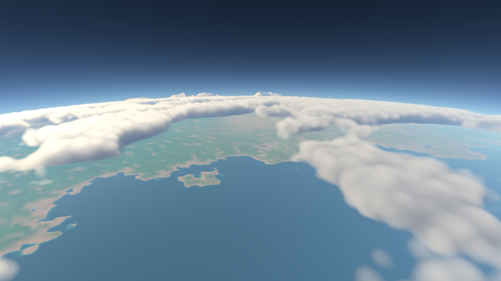
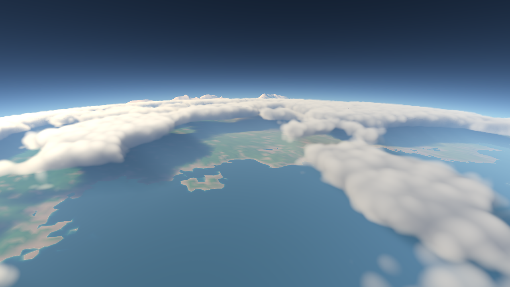

# Spherical volumetric clouds

Clouds are enabled by default. **C** toggles clouds and clear air; **F** disables
both atmosphere and clouds. The field is seeded with the planet, follows its
curvature, and supports cameras below, inside, or above the layer. Moving cloud
shadows share this density field and wind clock, dimming direct sunlight on
terrain, water and atmospheric haze.



## Controls

```powershell
# Normal launch, including clouds
.\bin\universebuild.exe
# More GPU headroom; quarter width and quarter height
.\bin\universebuild.exe -cloud-scale=0.25
# Coverage: 0 is clear, 1 is the densest setting
.\bin\universebuild.exe -cloud-coverage=0.7
# Clear-air reference
.\bin\universebuild.exe -clouds=false
# Keep visible clouds but disable their cast shadows
.\bin\universebuild.exe -cloud-shadows=false
```

`-cloud-scale` accepts 0.25, 0.5 (default), or 1. Coverage defaults to 0.52.
The layer lies 2.2–5.2 km above the configured sea level and rotates around the
polar axis at about 15 m/s at the equator. It uses the continuous simulation
clock, not the short looping water clock. `-air-passes=false` disables clouds
as well; that option retains the inline clear-air reference.

The earlier screen-space sun shafts do not run in cloud mode: they execute
before cloud composition and have no cloud visibility. Physical view scattering
uses the existing terrain-shadow visibility and cloud extinction. **R** still
controls the extra clear-air screen-space effect and underwater shafts.

Cloud shadows are enabled by default. **H** disables them together with terrain
shadows; **C** or **F** also disables them. Broad cloud shading stays active
underwater even though hard local shadows and the visible cloud pass normally
turn off there. This keeps sunlight consistent when crossing the waterline.

## Integration

The view ray intersects a spherical shell. The hollow inner sphere is subtracted
from the outer sphere, including both shell segments for grazing orbital views.
Opaque scene depth and the nearer analytic ocean intersection limit the ray.
This keeps clouds behind visible terrain and ends air at the water surface.

One compute pass integrates air and clouds together in depth order. It uses
Beer–Lambert transmission, a forward/backward scattering phase mixture, five
cloud sunlight samples, and a bounded approximation to multiple scattering.
The atmospheric sunlight table supplies wavelength-dependent sun attenuation;
terrain shadow maps can shade the cloud volume. Clear-air segments before,
between and after the shell reuse the existing atmospheric integrator.

The march uses at most 96 samples per shell segment, with more samples near the
eye and an early exit for near-zero transmission. Jitter is fixed per output
pixel, so a frozen scene does not receive a new noise pattern every frame.
There is no temporal accumulation or reprojection yet.

Cloud shape, cellular erosion and large-scale coverage come from a seeded
64³ linear noise volume. The engine currently supports sampled 2D textures;
we pack slices and a complete, explicitly averaged **3D** mip chain into a
528×723 RGBA8 atlas. Periodic gutters and two bilinear slice reads provide
trilinear sampling. Neighboring volume mip levels are blended according to
the ray footprint and integration interval. Ordinary 2D atlas mip generation
would incorrectly blend unrelated slices.

The compute pass writes radiance plus endpoint distance and RGB transmission
to two reduced-resolution RGBA16F targets. The existing depth-aware atmospheric
reconstruction produces `scene * transmission + radiance` in linear HDR.
Cloud and clear-air modes share the full-resolution output and presentation
pass. At 3840×2054, the default cloud targets add about 30.1 MiB plus a 1.46 MiB
noise atlas. Resources remain allocated while C switches modes.

## Cloud shadows

A compute pass builds a sun-aligned optical-depth field before scene lighting.
The 512×512 RGBA16F atlas uses 2 MiB and contains four 256×256 tiles: a local
128 km projection and a whole-planet projection, each with separate near and
far shell lobes. Each tile stores cumulative optical depth at four heights along
its lobe. Receivers interpolate those depths and apply Beer–Lambert transmission.
Mountains above a cloud remain sunlit; receivers inside it receive partial
attenuation. The empty interior between shell lobes contributes no extinction.

The local projection snaps to complete 500 m texels and blends into the global
projection before its edge. Coordinates are planet-relative, independent of
render-origin rebasing. Bilinear samples stay inside their atlas tile; the
density integral also filters the noise to the sample footprint. Coverage,
layer heights and wind parameters are identical to those of the visible clouds.

Terrain, ocean glints, foam, seabed sunlight and caustics receive this visibility.
Air scattering samples it along the view ray; underwater shafts use one sample
along their short integration path. Ambient lighting remains unchanged. The
visible clouds retain their existing sunlight march for self-shadowing, avoiding
applying the cached extinction twice to cloud lighting.



## Performance and validation

The HUD/JSONL report `cloud volume`, `cloud composite`, `cloud shadows` and shared
`air present` GPU times, plus requested/active cloud and cloud-shadow modes,
coverage and scale. Before cast shadows were added, on the
RX 7900 XTX at 3840×2054, matched half-resolution comparisons added about
1.12 ms on land, 1.29 ms at the coast and 3.24 ms in an orbital terminator view.
See [rendering performance](rendering-performance.md#first-cloud-layer-2026-10-09)
for the complete method, totals and quarter-resolution results.

With clouds already visible, adding cast shadows costs about **0.40–1.40 ms**
in four fixed views at 3840×2054 on that GPU. This includes the producer and all
consumer lookups, not just the atlas dispatch. See the
[cloud-shadow comparison](rendering-performance.md#cloud-shadows-2026-10-09)
for matched totals and reproduction settings. These are fixed-view measurements,
not a maximum cost across the world.

```powershell
go generate ./atmosphere
go test ./...
go vet ./...
$env:PLANET_GPU_TEST = '1'
$env:GLYPHENGINE_SYNC_VALIDATION = '1'
go test ./atmosphere -run '^TestCloud' -count=1
Remove-Item Env:PLANET_GPU_TEST
Remove-Item Env:GLYPHENGINE_SYNC_VALIDATION
go build -o bin/universebuild.exe .
python tools/capture_clouds.py --scenes ground coast inside above orbit night --output captures/cloud-check
```

GPU regression checks exercise the actual atlas sampler across periodic seams
and all seven mip levels, spherical entry/exit and terrain clipping, mode
toggles, target recreation, and a dispatch smaller than the live target.
Cloud restoration matches a frozen reference within one 8-bit channel level.
The shadow GPU fixture runs the production integrator with constant density and
checks its result against analytic path lengths, including inside/above-cloud
receivers, both lobes, atlas edges and disabled shadows. Lifecycle checks update
the shadow producer while switching modes and resizing targets.
Validation captures cover day/night, coastal water and inside/above-layer views.
The 3,600-frame descent/ascent tour passed Vulkan validation and confirmed
clouds disable underwater and restore above water. A fixed underwater comparison
with clouds requested on/off was pixel-identical before cast shadows were added.
At zero cloud coverage, the
ground comparison against clear air differed by 0.134/255 mean RGB (99th
percentile 1/255); sparse silhouette differences remain from reconstruction.

## Current limits and next work

- Cached cast shadows resolve broad formations: 500 m local texels and four
  optical-depth knots per lobe smooth small features and vertical density changes.
  The global projection is coarser still. These are filtered approximations,
  not per-receiver cloud ray tracing. Mountains can shade clouds within the
  existing terrain shadow-map coverage.
- Ocean reflections and the refracted sky seen from underwater remain clear-air
  views. The cloud view pass is disabled underwater to preserve water composition.
- The single fixed layer has fairly soft, broad formations. Sun-facing edges can
  be very bright. Thin silhouettes use the existing clear-air reconstruction
  fallback when no depth-compatible cloud sample exists. Density shaping,
  finer silhouettes and quality during fast motion need further refinement.
- Multiple scattering and ambient cloud illumination are approximations. This
  is not a weather simulation or a full radiative-transfer solution.
- A later temporal path must account for camera rebasing, moving clouds, changing
  depth/visibility, water crossings and resize. History allocation alone is
  insufficient; retain this non-temporal path as a reference.

The engine dependency pins the published commit from
[PR #193](https://github.com/derekmwright/glyphengine/pull/193), adding opt-in shared
sampler and named GPU timer capacities for requests #191 and #192. The showcase
requests five shared sampler slots and a capacity of 32 application timers;
seventeen are registered. The cloud-shadow field occupies slot 4 (binding 11).
[Request #190](https://github.com/derekmwright/glyphengine/issues/190) for native
sampled 3D textures remains separate; the existing noise atlas needs no such API.

Method references include Guerrilla's
[The Real-Time Volumetric Cloudscapes of Horizon Zero Dawn](https://www.guerrilla-games.com/read/the-real-time-volumetric-cloudscapes-of-horizon-zero-dawn)
for noise-shaped participating media and efficient lighting, and
[A Scalable and Production Ready Sky and Atmosphere Rendering Technique](https://sebh.github.io/publications/egsr2020.pdf)
for atmospheric composition. The showcase uses its own smaller implementation;
it does not reproduce either production renderer in full.
